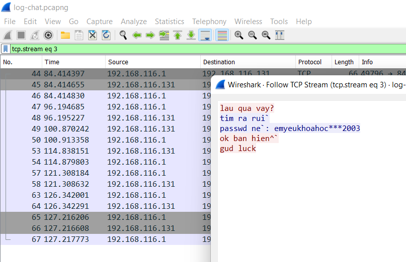
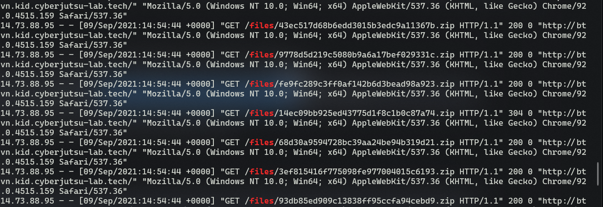
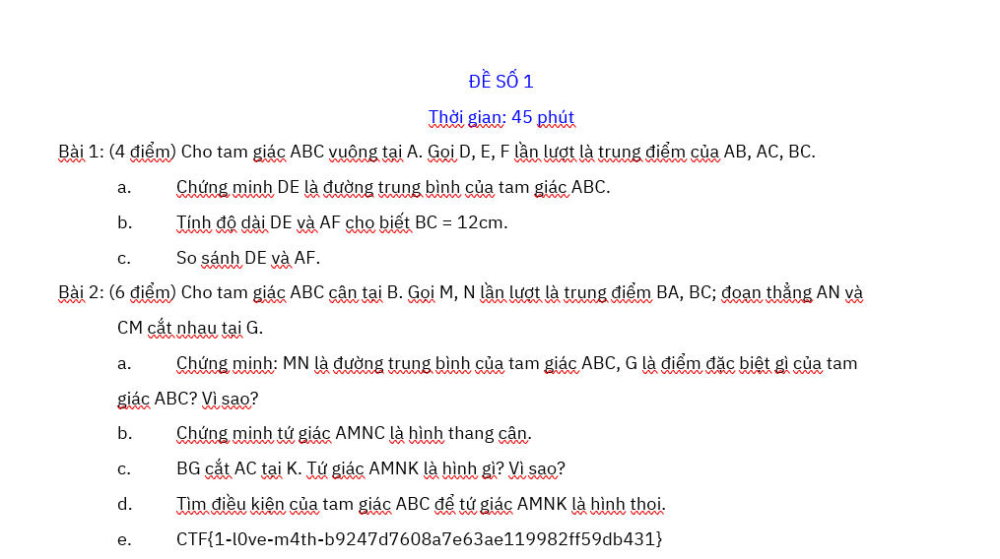

# **Bài tập quá hạn**
> 200 điểm 
```
Gần đây phải học online, trường của Minh làm hẳn một trang web để đưa bài tập cho các bạn học sinh.

http://btvn.kid.cyberjutsu-lab.tech/

Nhưng lần này, cậu ấy lỡ tay xóa mất file bài tập trên máy tính của mình rồi. Thật buồn là đã quá hạn truy cập vào trang web để tải bài tập.
Hãy giúp Minh tìm lại file bài tập nhé!

Những manh mối ta có:

- Access log của server btvn.kid.cyberjutsu-lab.tech
- Trích xuất gói tin mạng đoạn chat giữa Minh và một người bạn
```
Sau khi tải các file đính kèm về, chúng ta nhận được file log và file pcap.

Phân tích file pcap và follow TCP stream, chúng ta thấy được đoạn hội thoại giữa hai bạn. Sau đó đến stream thứ 4, chúng ta có được pass giải nén file bài tập như hình.

  

Tiếp đến, vì website không thể truy cập được nữa, nên mình quyết định lục lọi file log. Do chúng ta đã có được pass giải nén nên file cần tìm là một file nén :v

Mình sử dụng `grep -w "files"` trong quá trình đọc file để tìm chuỗi "files" và ra được kết quả như hình

  

Như các bạn đã thấy, có khá nhiều file zip khác nhau, nhưng chỉ duy nhất có một file với http status là 304 

*14.73.88.95 - - [09/Sep/2021:14:54:44 +0000] "GET /files/14ec09bb925ed43775d1f8c1b0c87a74.zip HTTP/1.1" 304 0 "http://btvn.kid.cyberjutsu-lab.tech/"*

Từ đó mình copy đoạn '/files/14ec09bb925ed43775d1f8c1b0c87a74.zip" vào URL của website và nhận được file zip.

Extract theo password là "emyeukhoahoc***2003", chúng ta nhận được một file word, mở ra và thấy flag.

  

### **FLAG: CTF{1-l0ve-m4th-b9247d7608a7e63ae119982ff59db431}**

